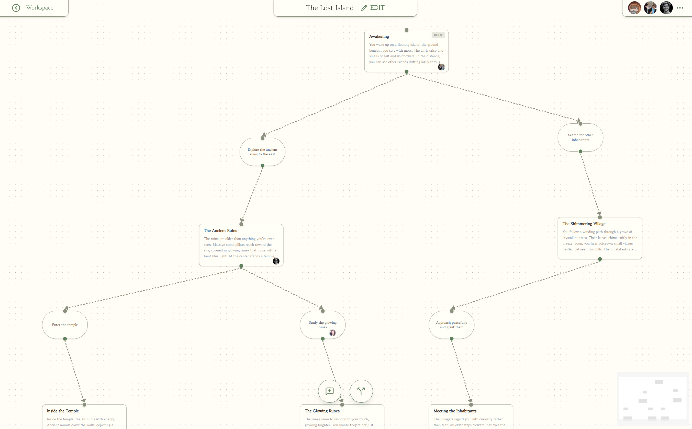
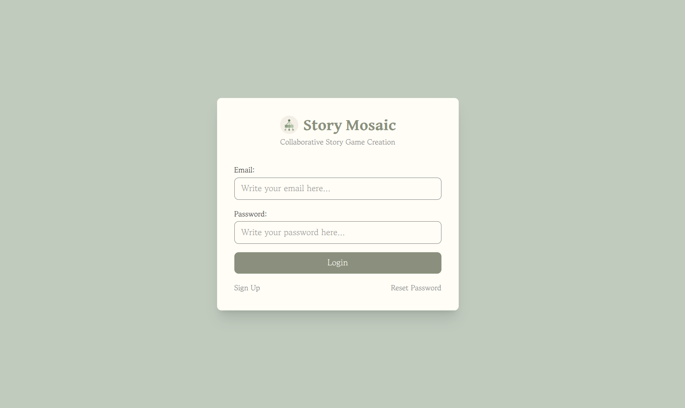
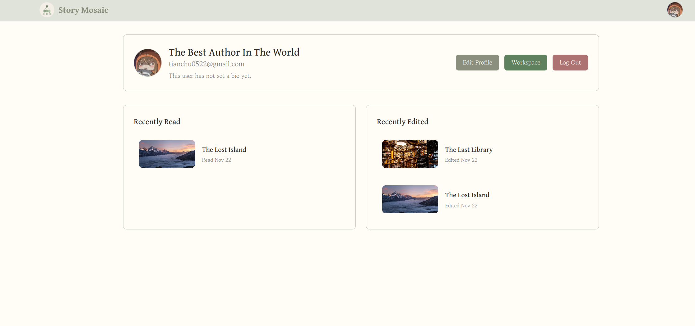
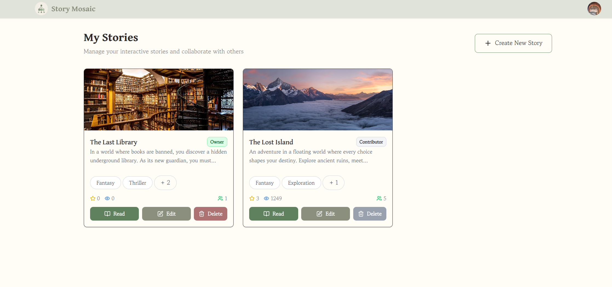
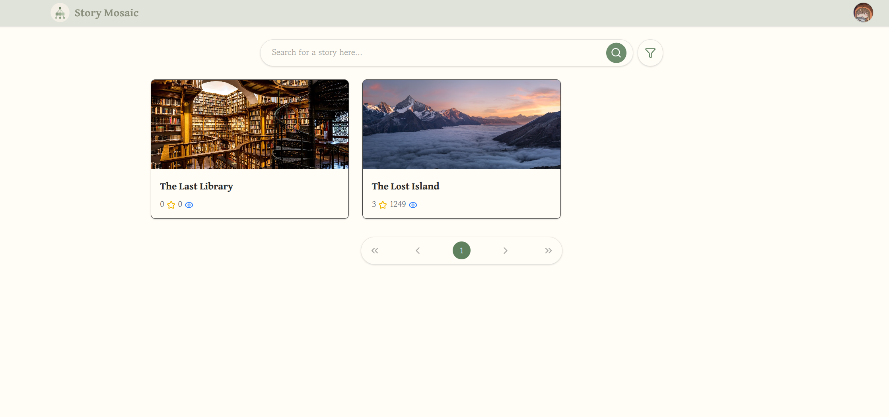
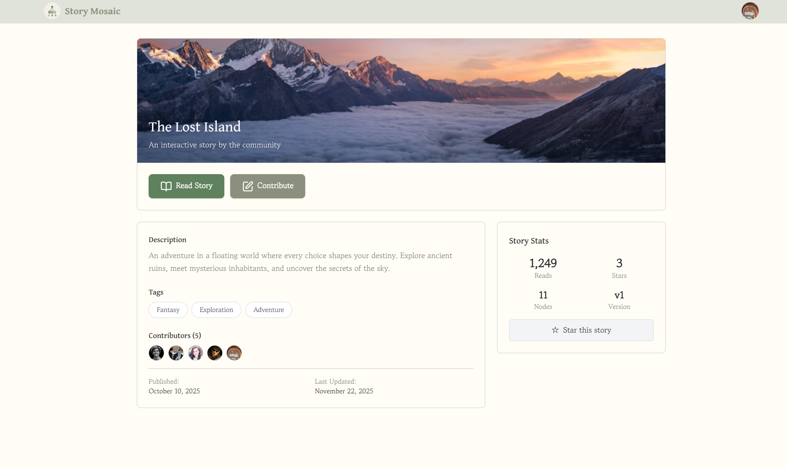
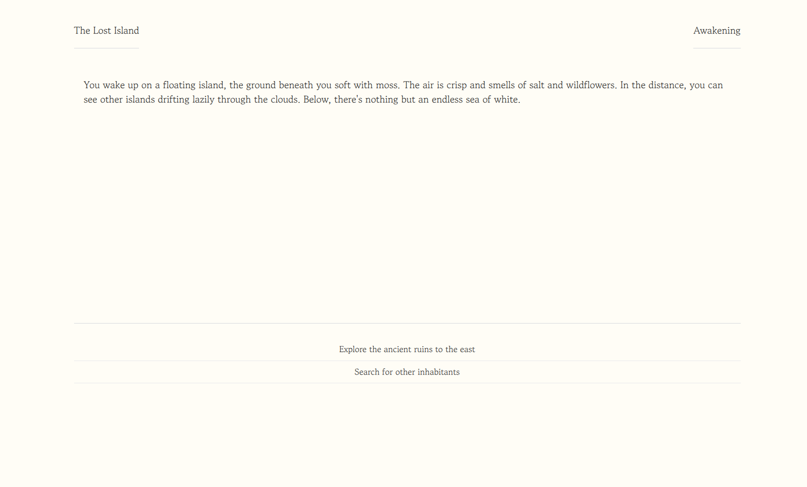

# Story Mosaic

A web-based collaboration platform to let multiple writers participate in the writing of Choose-Your-Own-Adventure stories.

**Members:**

- Li Tianchu
- Liu Zimeng
- Chang Kejia

## Developing

This project is organized into client (frontend) and server (backend)

- To install the client dependencies, in the project root directory, run `cd client` and `npm install`
- To install the server dependencies, in the project root directory, run `cd server` and `npm install`

## Building

This project uses docker container for testing and running together with docker compose to orchestrate multiple containers

- To build for **development**, in project root directory, run `docker compose -f docker-compose.dev.yml up --build`
- To build for **production**, in project root directory, run `docker compose up --build`
- After **development** build, you can initialize the Database by running `docker compose -f docker-compose.dev.yml exec mongodb mongosh story-mosaic scripts/init-mongo.js` in project root directory
- After **production** build, you can initialize the Database by running `docker compose exec mongodb mongosh story-mosaic scripts/init-mongo.js` in project root directory
- Note that the database data is mounted with a volume named `mongodb_data`
- Since we used **Cloud Storage for Firebase** to host the image assets:
  - Place `serviceAccountKey.json` under `./server` (ignored by git) and set `FIREBASE_SERVICE_ACCOUNT_PATH=./serviceAccountKey.json`.
  - The frontend Firebase Web config is provided via `client/.env`.

## Testing

- The frontend is reachable at host machine **port 3001**
- The backend is reachable at host machine **port 5001**
- The database is reachable at host machine **port 27017**
- After building, to see the web app, open your browser and go to **<http://localhost:3001>**

## General

### Problem Statement

Choose Your Own Adventure is a type of story-based game in which readers can select the branch/route of the story as they are reading it.

However, it will be a lot of work for the writers to create such stories due to the large number of branching storylines.

We propose a web-based collaboration platform to let multiple writers participate in the writing of Choose-Your-Own-Adventure stories. Writers can post their own story or join and work on other stories. While audiences can play those stories in a web-based reader.

### Solution Architecture

The application follows a modern separated front-end and back-end architecture:

**UI Design**

We follow a strict color scheme guideline with a UI concept inspired by books

Color Scheme:

- Button for Add: 5E815E
- Button for Delete: AC7373
- Other buttons: 8A907D
- Tag outline(unselected): 8A907D
- Tag fill when selected: 6A934B
- Text/Symbol in dark bg: FFFDF8
- Text/Symbol in bright bg: 2B2B2B
- Text indicating warning: 964F4F
- Fainted text: 7A7A7A
- Website bg for content: FFFDF6
- Website bg under content: C0CABD
- Flowchart node bg: FFFEF7
- Flowchart connector: 8A907D
- Search bar bg: FDFDFD
- Content separator: 2B2B2B

Figma Link (Early Concept):
<https://www.figma.com/design/6DSZTP54KIRCYI2mcJQUd0/StoryMosaicDesign?node-id=0-1&t=VOid60fFATSyXFcw-1>

**Client Layer (React SPA)**

- Single Page Application built with React 19 and TypeScript
- Real-time UI updates using Socket.IO client (v4.8.1)
- State management with React hooks (useState, useEffect, useContext, useMemo, useCallback)
- Interactive flowchart editor using React Flow (@xyflow/react v12.8.6)
- Styling with Tailwind CSS v4
- Nginx as static file server in production
- Vite v7 for fast development and optimized production builds

**Server Layer (Node.js/Express)**

- RESTful API server built with Express.js v5.1.0 and TypeScript
- WebSocket server using Socket.IO v4.7.5 for real-time collaboration
- Firebase Admin SDK v13.6.0 for server-side authentication
- Multer v2 for multipart file upload handling (user avatars and story cover image)

**Database (MongoDB)**

- MongoDB database with Mongoose v8.18.2

**Deployment Architecture**

- Docker containerization with docker compose orchestration
- Three separate containers: frontend (Nginx), backend (Node.js), mongodb
- MongoDB data persistence with named volume
- Dockerfile in both `/client` and `/server` folders

### Legal Aspects and Business Model

Story Mosaic is mostly built using open-source tools and will adopt an open-source licensing model (likely GPL or MIT) to embrace a collaborative ecosystem where developers can contribute to the platform's codebase and authors retain ownership of their creative works under Creative Commons or similar licenses.

We plan to have the core platform remains free for all users, while we can have premium features like advanced analytics for authors, enhanced collaboration tools (unlimited co-authors, version history) provided in a subscription plan.

### Competition Analysis

**ChooseYourStory.com**

A popular platform for creating and hosting choose-your-own-adventure stories with co-author features, but authors cannot see other co-author's changes in a real-time manner, and it does not have an intuitive GUI based interface for editing the story.

**VocaTales**

A popular story creation software that offers real-time collaborative writing for both traditional linear stories and branching narratives, but does not offer publishing and hosting for others to read.

**Wattpad**

A huge online platform where people read and write stories. It’s mainly known for its social platform for storytelling, but it does not offer branching or choose-your-own-adventure stories.

Story Mosaic stands out by combining their merit: it lets multiple authors work together simultaneously in real-time to create branching stories while also providing a built-in community for readers, something no other platform currently offers in one place.

### List of Features

#### Authentication

- Login
- Sign up
- Change password

#### Account Management

- View the top recently read stories
- View the top recently edited stories
- Click on Workspace to view or edit your story
- Edit personal profile, including display name and bio
- Log out

#### Story Management

- Create a new story
- Delete story (allowed when the user is the owner)
- Edit story
- Read story

#### Landing

- List all stories, with brief statistics
- Search by title
- Filter by tag
- Pagination
- Click on the story card to navigate to the respective story detail page
- Click on the avatar to go to the account management page

#### Story Editing

- View story tree in flowchart
- Add paragraph nodes in the flowchart
- Add branch option nodes in the flowchart
- Link two nodes
- Double click to edit the node
- Delete node or link by pressing delete button or DELETE key on keyboard
- Publish modification (the modified story tree will not reflect on the reader's side until it is published)
- Update story title, tags, and descriptions
- Concurrency locking (lock the node when another author is editing to prevent data corruption)
- Show the profile picture of the author when he/she is editing a node
- Show the current online contributors at the top right corner

#### Story Detail

- Star the story
- View story title, contributors, tags, description, and version
- View stars and number of reads
- Click on Read to go to the reader page
- Click on Contribute to open the draft of the story in the story editing page

#### Reader

- Display paragraph content and options by tracing the story tree
- Next/Go back paragraph options
- Trigger branching according to the option selected

### List of Borrowed Code and Libraries

**Client**

- React <https://react.dev/>
- React Spring <https://react-spring.dev/>
- React Router <https://reactrouter.com/>
- React Flow <https://reactflow.dev/>
- Tailwind CSS <https://tailwindcss.com/>
- Socket.io Client <https://www.npmjs.com/package/socket.io-client>
- Fuse.js <https://www.fusejs.io/>
- Lucide <https://lucide.dev/>
- Nginx <https://nginx.org/>

**Server**

- Socket.io <https://socket.io/>
- Express.js <https://expressjs.com/>
- Multer <https://www.npmjs.com/package/multer>
- Mongoose <https://mongoosejs.com/>

**Language**

- Typescript <https://www.typescriptlang.org/>

**Tooling**

- Vite <https://vite.dev/>
- Eslint <https://eslint.org/>
- Firebase SDK <https://www.npmjs.com/package/firebase>
- Firebase-admin SDK <https://www.npmjs.com/package/firebase-admin>

## Implementation

### Frontend

The frontend is built as a React Single Page Application (SPA) with TypeScript, following a component-based architecture:

**Routing**

- React Router DOM v7.9.3 for client-side navigation
- Routes: `/` (Landing), `/auth` (Authentication), `/story/:storyId` (Story Detail), `/edit/:storyId` (Editor), `/reader/:storyId` (Reader), `/managestory` (Story Management), `/account` (Account Management)
- Protected routes pattern with Firebase authentication
- 404 fallback for undefined routes

**Components**

- **Common Components**: Logo, Navigation, UserAvatar, Loading, Message, TagChip, TagFilterModal, StoryCard, BackToHomeButton, ProtectedRoute
- **Auth Components**: AuthMain, LoginForm, SignUpForm, ResetPasswordForm
- **Edit Components**: EditMain, Flowchart, ParagraphNode, OptionNode, ParagraphEditor, OptionEditor, NormalEdge, Toolbar, CollaboratorAvatarStack, CollaboratorView, DeleteNodeButton, UpdateNodeButton, BackToStoryManagement, StoryMetaEditor
- **Landing Components**: LandingMain, SearchBar
- **Reader Components**: ReaderMain, ChoiceSelector, StoryTitle, TextBody, ChapterHeader
- **StoryDetail Components**: StoryDetail, StoryDetailHeader, StoryDetailInfo, StoryDetailStats
- **AccountManagement Components**: AccountManagement, ProfileEditor, StoryList
- **ManageStory Components**: ManageStoryMain, ManageStoryCard, CreateStoryModal

**Custom Hooks**

- `useAuth`: Firebase authentication with backend user profile synchronization
- `useSocket`: Socket.IO connection management via React Context
- `useManagedStories`: Fetch stories that are managed by the current user
- `useStoryDetail`: Fetch story details data
- `useUser`: User profile management and updates

**State Management**

- React Context API for global socket connection (SocketContext, SocketProvider)
- Local component state with useState for UI-specific data
- useEffect for data fetching, subscription, and cleanup
- useMemo for expensive computations
- useCallback for stable function references, preventing unnecessary re-renders
- useRef for mutable values that don't trigger re-renders

**Real-time Collaboration**

- Socket.IO client connection established on app mount
- Room-based architecture: clients join story-specific rooms via `join-story-room` event
- Socket events listened: `node-created`, `node-updated`, `node-deleted`, `connection-created`, `connection-deleted`, `node-position-updated`, `user-joined-node`, `user-left-node`, `user-joined-story-draft`, `user-left-story-draft`
- Optimistic UI updates for immediate feedback
- Active contributor tracking with visual avatar badges on nodes
- Automatic cleanup on component unmount (leave-story-room)

**Flowchart Editor (React Flow)**

- Interactive node-based graph visualization
- Custom node and edge types
- Drag-and-drop node positioning with real-time sync
- Connection validation preventing invalid links (e.g., option→option)
- Other features: MiniMap, zoom controls, background grid

**Fetch API (`services/api.ts`)**

- Centralized API service
- Base URL configuration: `VITE_API_URL` env variable or inferred from hostname
- API modules: `authApi`, `storyApi`, `storyVersionApi`, `storyNodeApi`, `userApi`, `readSessionApi`, `starApi`
- Async/await pattern throughout
- FormData support for file uploads (user avatars)

**Styling**

- Tailwind CSS v4 with utility-first approach
- Custom color scheme defined in `index.css` file
- Flex box-based design for responsiveness across mobile and desktop

### Backend

The backend follows a layered MVC-style architecture with Express.js:

**Server Initialization (`src/index.ts`)**

- HTTP server creation with Socket.IO integration
- MongoDB connection via Mongoose
- Port configuration
- CORS configuration allowing all origins with multiple HTTP methods

**Application Setup (`src/app.ts`)**

- Health check endpoint at `/health`
- API routes mounted under `/api/*`
- 404 handler for undefined routes

**Route Layer (`src/routes/`)**

- Routes available:
  - `/api/stories` - Story CRUD operations
  - `/api/story-nodes` - StoryNode operations
  - `/api/story-versions` - Version management
  - `/api/users` - User profile operations
  - `/api/read-sessions` - Reader state tracking

**Controller Layer (`src/controllers/`)**

- Business logic (CRUD) for each resource
- Input validation using helper functions (ensureValidId, ensureStoryExists, parseIdArray)
- MongoDB operations with Mongoose object modelling
- Socket event emission after state changes
- Response serialization for socket response

**Model Layer (`src/models/`)**

- Mongoose schemas with TypeScript interfaces
- Models: Story, StoryVersion, StoryNode, User, Star, ReadSession

**Middleware (`src/middleware/`)**

- **errorHandler.ts**: Centralized error processing
- **upload.ts**: Multer configuration for file uploads

**Socket.IO Server (`src/socket.ts`)**

- Clients join via `join-story-room` event passing storyVersionId
- Events emitted by server:
  - `user-joined-story-draft` - when user joins editing session
  - `user-left-story-draft` - when user leaves editing session
  - `user-disconnected` - on socket disconnect
  - `join-story-draft-error` - when join fails
  - Socket events from controllers: `node-created`, `node-updated`, `node-deleted`, `connection-created`, `connection-deleted`, `node-position-updated`, `user-joined-node`, `user-left-node`
- Automatic cleanup on disconnect by removing user from activeContributors in story and all nodes

**Data Models Detail**

- **Story**: title, description, tags (100+ predefined tags), owner (userId), contributors array with {userId, joinedAt}, activeContributors array, rootNodeId, coverImageUrl, timestamps
- **StoryVersion**: storyId reference, versionName, isPublished flag, timestamps
- **StoryNode**: storyId, versionId, type (paragraph/option), parentNodeIds array, targetNodeIds array, positionOnFlowchart {x, y}, activeContributors array, chapterTitle (for paragraphs), content, createdBy, updatedBy, timestamps
- **User**: uid (Firebase), email, displayName, bio, avatarUrl, timestamps
- **Star**: userId, storyId reference, timestamps (for favoriting stories)
- **ReadSession**: userId, storyId, currentNodeId, visitedNodeIds array, timestamps (for tracking reader progress)

**Firebase Admin Integration (`src/config/firebaseAdmin.ts`)**

- Service account authentication
- Firebase Storage bucket configuration
- Used for validating Firebase ID tokens

### Integration

**Authentication Flow**

1. Client authenticates with Firebase Authentication
2. Firebase ID token sent with each API request
3. User ID extracted and used for authorization

**Real-time Collaboration**

1. User joins story editing page → Socket connects and joins story room
2. User selects/edits node → API call updates database → Socket event emitted to room
3. All clients in room receive event → Update local state → UI re-renders
4. User leaves page → Socket cleanup removes from activeContributors

## Novel Features

### Collaborative Story Creation

Our platform enables multiple writers to work together on branching narratives through several innovative mechanisms:

#### Real-time Collaborative Editing (Frontend + Backend)

The story editor allows multiple authors to simultaneously edit different parts of the same story through the use of `Socket.IO` for real-time client communication, with visual indicators showing which nodes other contributors are currently editing. It has automatic conflict prevention through node-level locking, and live updates propagate instantly to all connected users via WebSocket

#### Flowchart-Based Story Structure (Frontend)

The story editor ships with an interactive visual graph representation of story branches using `React Flow` with drag-and-drop node positioning and visual connection for intuitive story organization  

#### Interactive Story Reader (Frontend)

The reader provides an engaging, game-like experience for exploring branching narratives, with smooth transitions between story segments and with fade-in animation created using `React Spring`

#### Contributor Management (Backend)

Stories will track all contributors with join timestamps, with an active contributor list showing who's currently online. We also have an ownership system to only allow owners to delete or publish a story

#### Version Control (Backend)

Draft and published versions are managed separately, writers work on drafts without affecting published content, and readers always see the stable published version

#### Firebase Authentication and Storage Integration (Backend)

We use Firebase for managing authentication services and media file storage

## Software Engineering Aspects

### Documentation

#### Code Documentation

- Comments on top of each component as well as beside complex logics
- TypeScript interfaces and types for self-documenting APIs
- Standard naming conventions for variables, functions, and components by following the camel case

#### Project Documentation

- Detailed project architecture description in README
- Development and Docker build instructions for consistent running environments

### Usability

- Frontend and backend data validation
- Constraint enforcement when creating story tree
- Clean UI with a consistent eye-friendly color scheme

### Modularization

- Common components for reusability (`Logo.tsx`, `Message.tsx`, `UserAvatar.tsx`, `StoryCard.tsx`, `TagChip.tsx`, etc)
- Custom hooks for encapsulating frequently used backend calls
- Client-side centralized fetch api for backend communication

### Library integration

**React Flow**: Integrated for interactive flowchart visualization, enabling drag-and-drop node positioning, custom node/edge rendering, and connection validation.

**React Spring**: Integrated for smooth animation in the interactive reader.

**Fuse**: Integrated for fuzzy searching story and story tags.

**Lucide**: Integrated for web icons with consistent style.

**Socket.IO**: Implemented for bidirectional real-time communication between clients and server, enabling live collaboration features with room-based isolation.

**Firebase SDKs**: Used for provide secure user authentication and managing media files.

**Mongoose**: Utilized as application data modeling for MongoDB, providing simplified database operations.

**Tailwind CSS**: Adopted for simplifying styling, enabling rapid UI iteration with consistent design system and responsive layouts.

**React Router**: Integrated for client-side routing, enabling SPA navigation.

**Multer**: Configured for handling image file uploads.

**Vite**: Used as build tool and dev server, providing Hot Module Replacement and optimized builds.

## Video Presentation

### <https://drive.google.com/file/d/1pASAQgM-YNizrpJqbA2M2F_Y_NcbCnos/view?usp=drive_link>

## Project Management

### Collaboration

The project team practices frequent commits with meaningful commit messages, with consistent progress updates through active communication

### Branches

The project is a monorepo for both client and server code, and uses a feature-based branching strategy:

- **`main`**: Main branch
- **`accountmanage`**: For commits to the account management feature
- **`auth`**: For commits related to authentcation feature
- **`common`**: For global commits that affect multiple parts of the project
- **`config`**: For configuration file updates
- **`edit`**: For commits to the edit story feature
- **`landing`**: For commits to the landing page
- **`reader`**: For commits to the interactive reader feature
- **`storydetail`**: For commits to the story detail feature
- **`storymanage`**: For commits to the manage story feature

Feature branches are merged to `main` after testing and validation
